# Proyecto Coder House
Backend de una aplicación de e-commerce para poder vender productos de un rubro a
elección.Contiene la logica para agregar, editar y elimar productos y usuarios, ademas de su respectivo carrito de compra.

El servidor se basará en un diseño de capas, orientado a MVC.

## Base URL
https://ecommerce-coder-production.up.railway.app

## Documentación con swagger
https://ecommerce-coder-production.up.railway.app/api-docs/

## Instalación 

- Instalar dependencias: 
```js
$ npm install
```

- Correr el proyecto: 
```js
$ npm run dev
```

Para visualizarlo los endpoints utilizar http://localhost:8080

## Capturas de pantalla

### Correo de eliminación de producto cuyo owner es premium
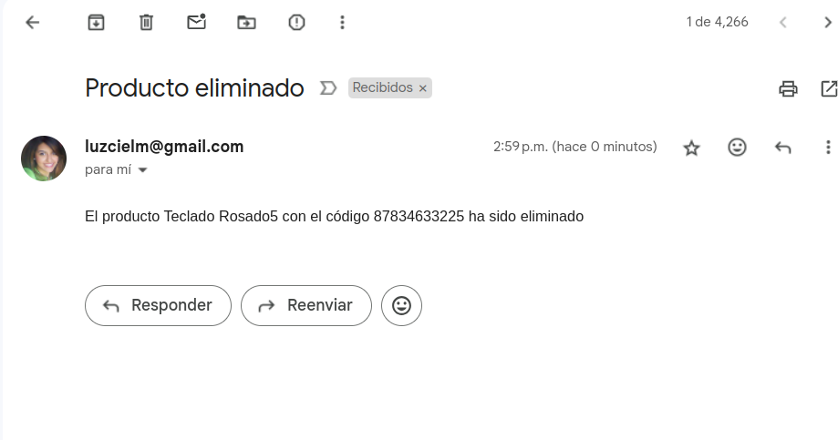

### Correo de eliminación de cuenta inactivas
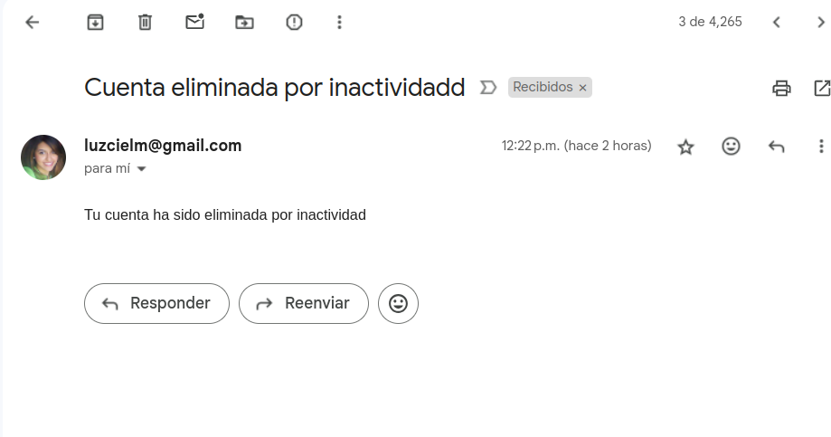

### Lista de usuarios
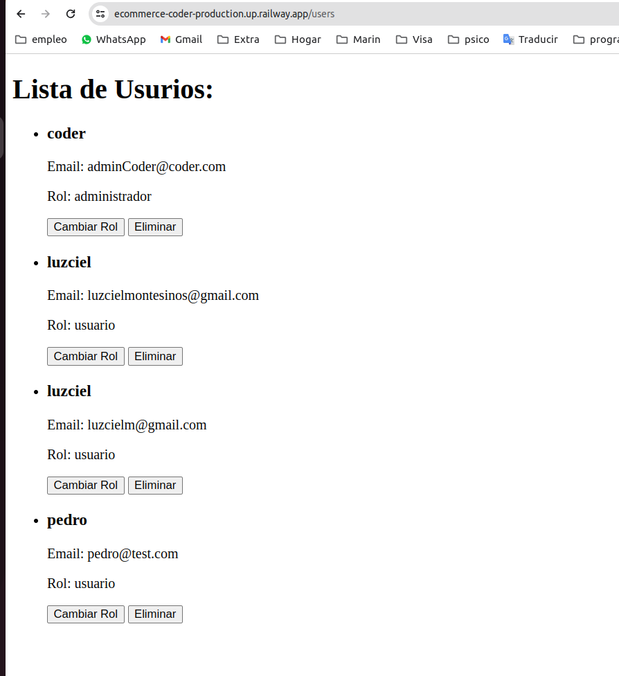

### Testing
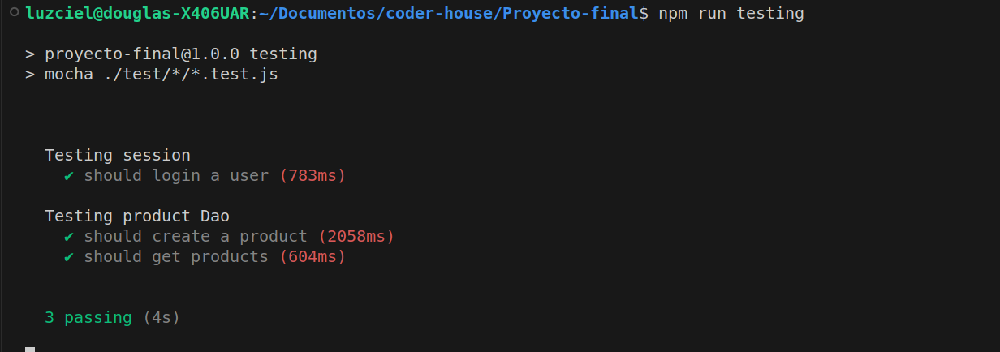

### Restablecimiento de contraseña

Login con link para restablecer contraseña
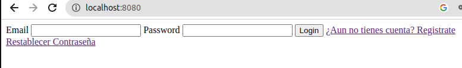


Ingresar correo para restablecer contraseña
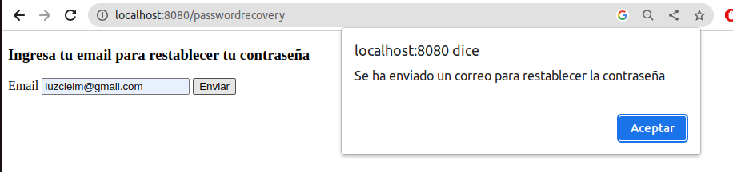


Email con link para restablecer contraseña
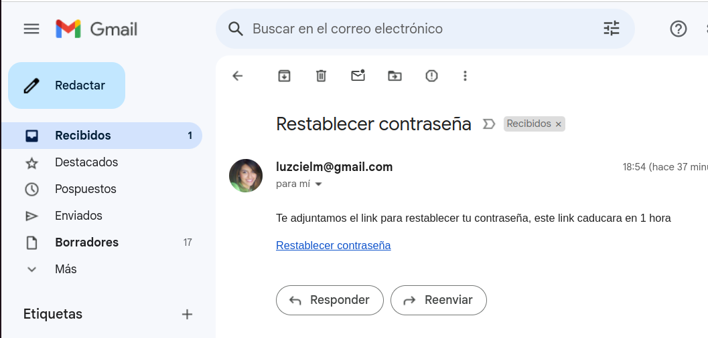


Restablecimiento de contraseña exitoso
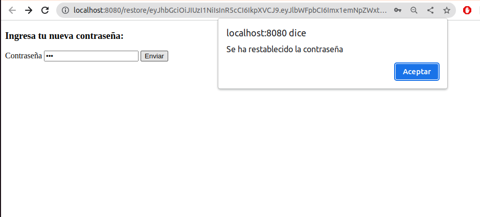


Error al ingresar la misma contraseña
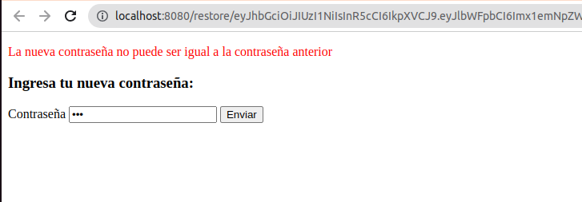


Link expirado
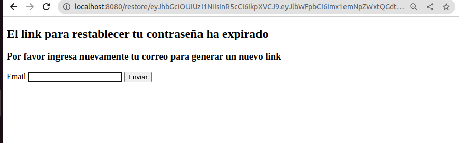

### Crear producto con owner premium
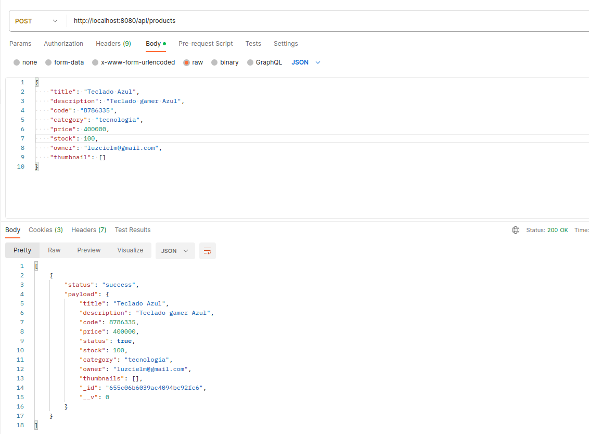

### Cambio de rol premium a usuario y viceversa
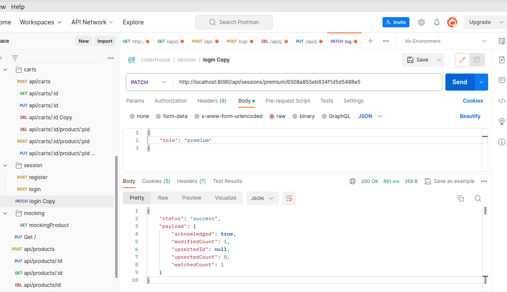
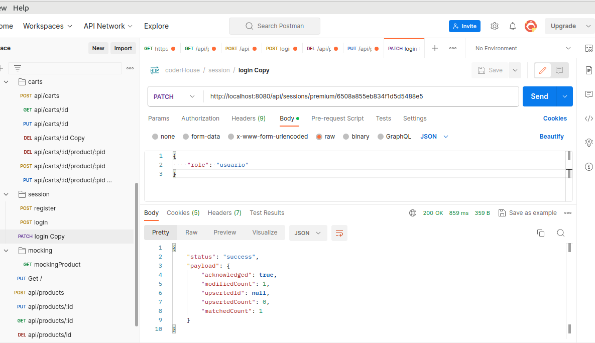

### Error al ingresar un producto al carrito cuando se es el owner del producto
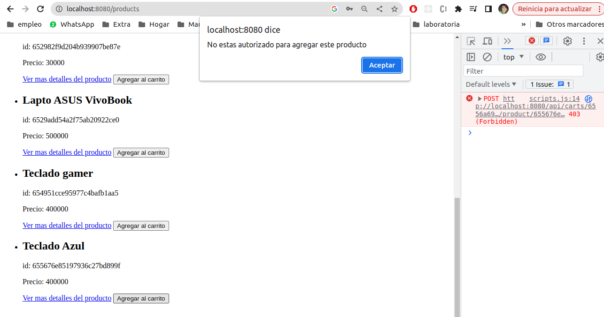

### Loggers de producción en la terminal
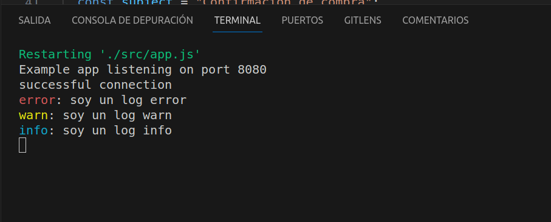

### Loggers de desarrollo en la terminal
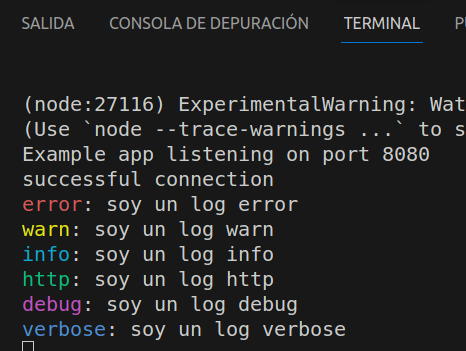


### Router mockingproducts
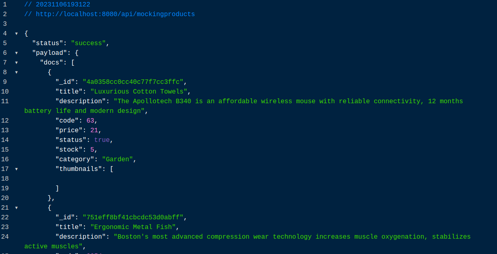


### Manejo de errores


### Correo de confirmación


### SMS de confirmación


### Router purchase 


### Router current 


### Postman
api/products


api/users


