# Proyecto Coder House

### A continuación se listan los endpoint que formarán parte de esta API:

#### Products
GET /api/products

GET /api/products?limit=numero&page=number&sort=asc&query={"category":"tecnologia"}

GET /api/products/:pid

POST /api/products

DELETE /api/products/:pid

PUT /api/products/:pid

#### Cart
GET /api/carts/:cid

POST /api/carts

PUT /api/carts/:cid

DELETE /api/carts/:cid

POST /api/carts/:cid/product/:pid

PUT /api/carts/:cid/product/:pid

DELETE /api/carts/:cid/product/:pid

#### Views 
-Login

/

-Registro del usuario

/register

-Perfil del usuario

/profile

-Lista de productos con paginación.

/products

-Detalles del producto seleccionado.

/products/:pid

-Lista los productos agregados al carrito.

/carts/:cid?

### Correo de confirmación

### SMS de confirmación
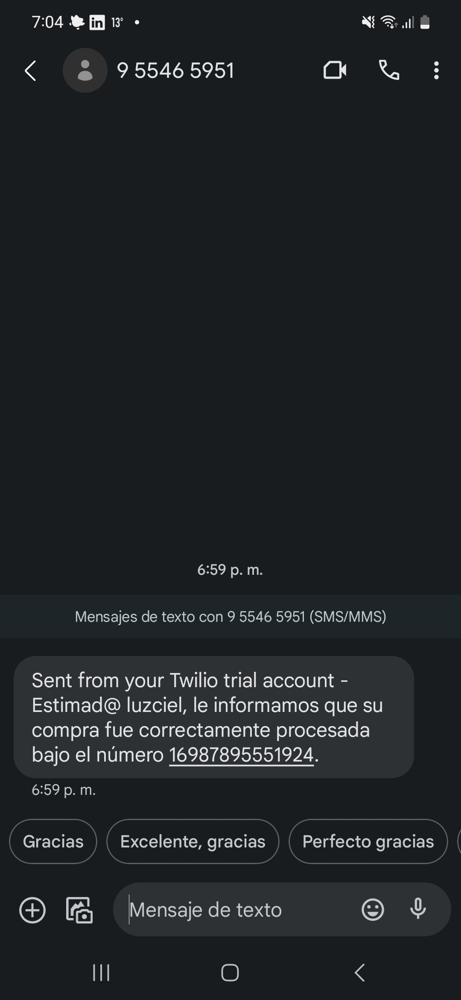

### Router purchase 
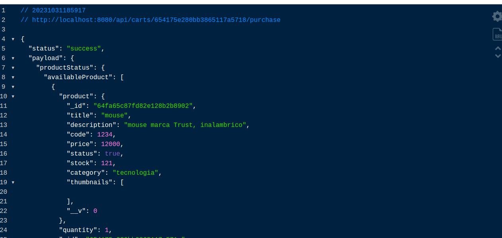
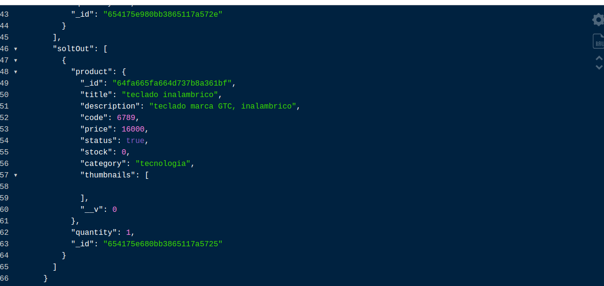

### Router current 
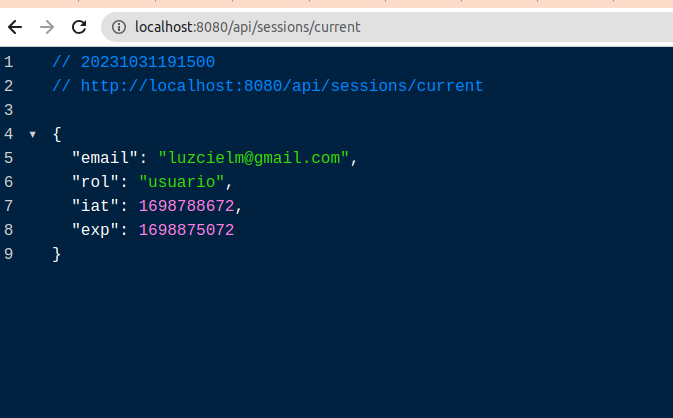

### Postman
api/products
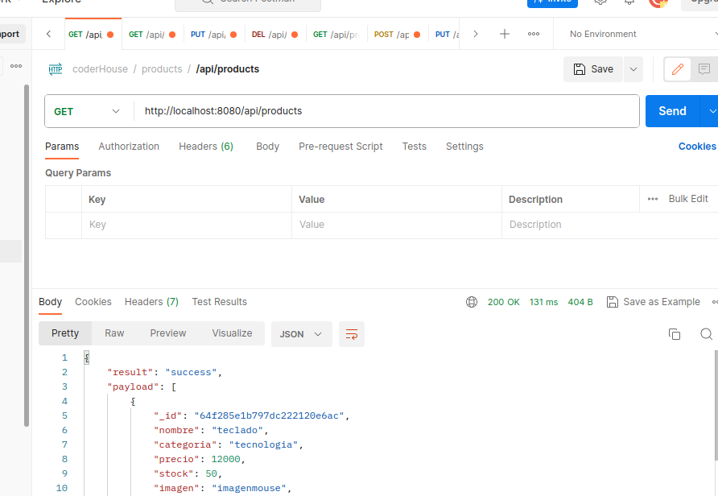
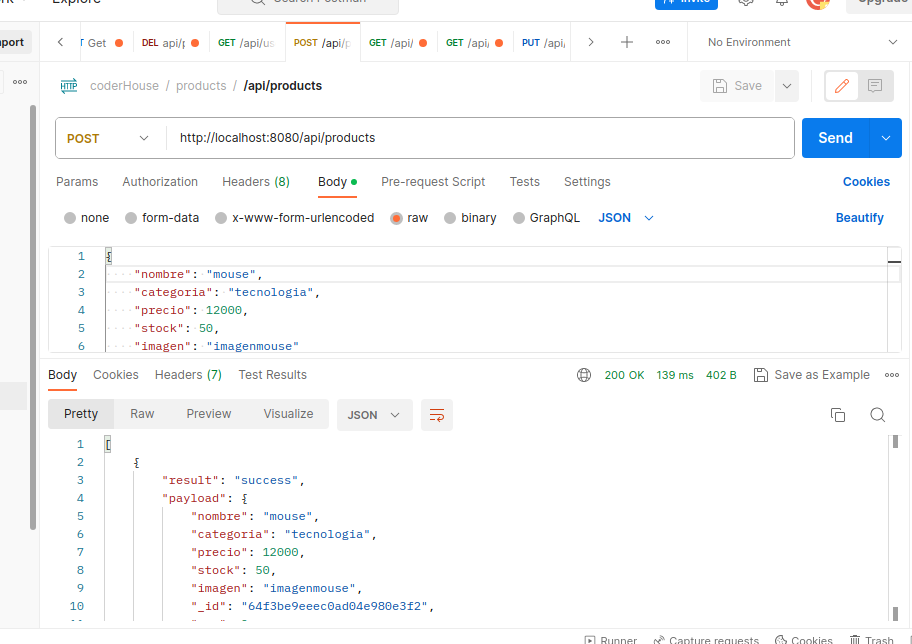
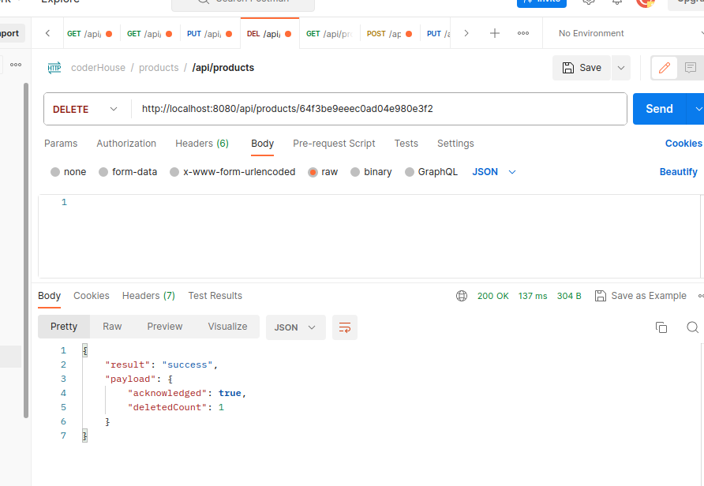
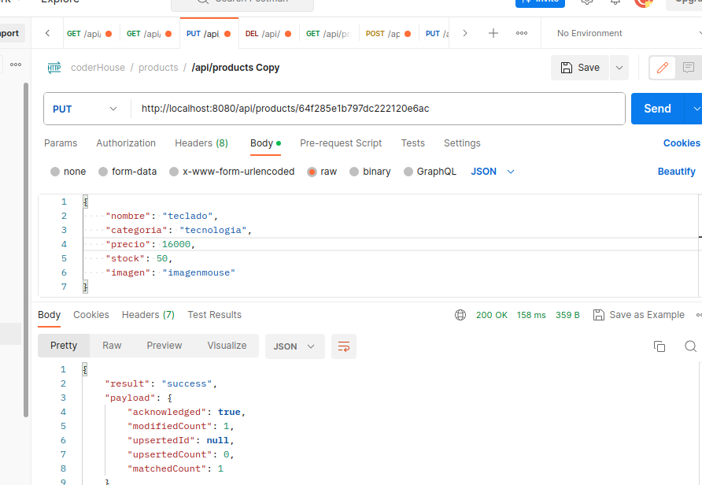

api/users
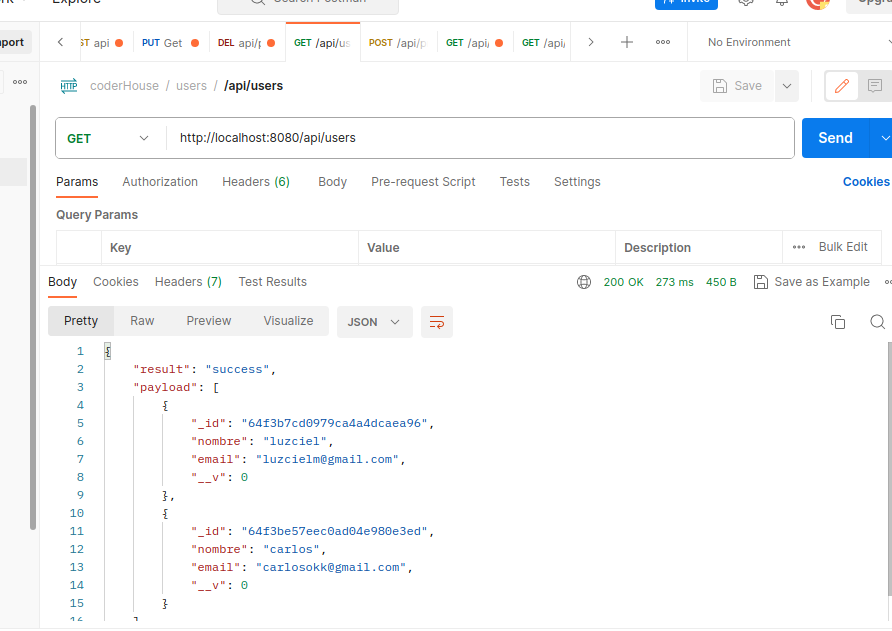
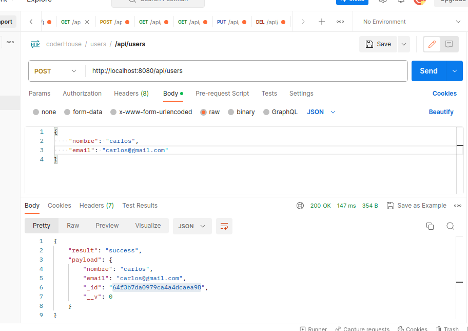
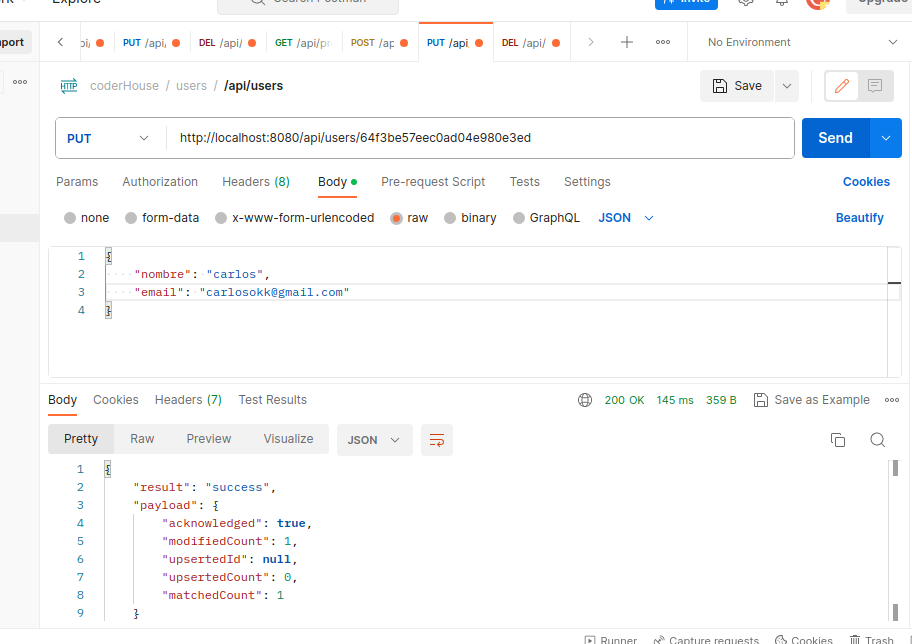