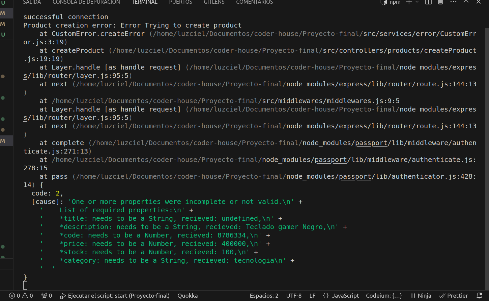
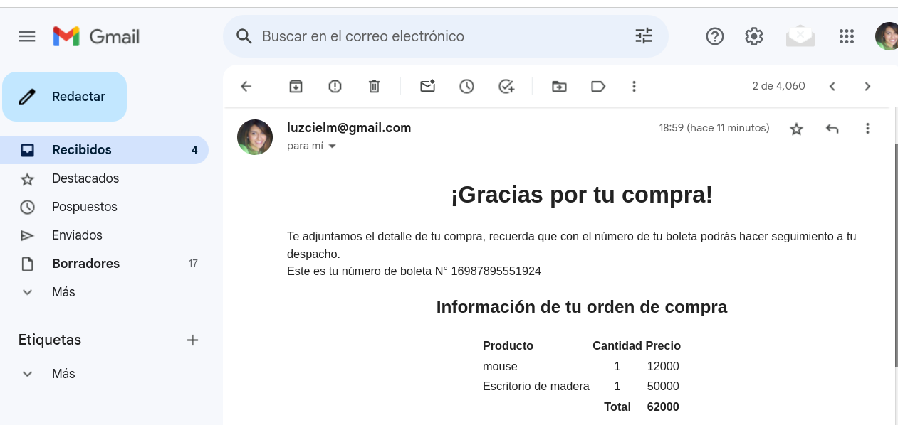

# Proyecto Coder House

### A continuación se listan los endpoint que formarán parte de esta API:

#### Products
GET /api/products

GET /api/products?limit=numero&page=number&sort=asc&query={"category":"tecnologia"}

GET /api/products/:pid

POST /api/products

DELETE /api/products/:pid

PUT /api/products/:pid

#### Cart
GET /api/carts/:cid

POST /api/carts

PUT /api/carts/:cid

DELETE /api/carts/:cid

POST /api/carts/:cid/product/:pid

PUT /api/carts/:cid/product/:pid

DELETE /api/carts/:cid/product/:pid

#### User
POST /api/users/register

GET /api/users/failregister

POST /api/users/login

GET /api/users/faillogin

GET /api/users/logout

GET /api/users/current

PATCH /api/users/premium/:uid

POST /api/users/passwordrecovery

PATCH /api/users/restore/:token

PATCH /api/users/premium/:uid 

#### Views 
-Login

/

-Registro del usuario

/register

-Perfil del usuario

/profile

-Lista de productos con paginación.

/products

-Detalles del producto seleccionado.

/products/:pid

-Lista los productos agregados al carrito.

/carts/:cid?

### Restablecimiento de contraseña

Login con link para restablecer contraseña

Ingresar correo para restablecer contraseña

Email con link para restablecer contraseña

Restablecimiento de contraseña exitoso

Error al ingresar la misma contraseña

Link expirado

### Crear producto con owner premium

### Cambio de rol premium a usuario y viceversa

### Error al ingresar un producto al carrito cuando se es el owner del producto

### Loggers de producción en la terminal

### Loggers de desarrollo en la terminal

### Router mockingproducts

### Manejo de errores

### Correo de confirmación

### SMS de confirmación

### Router purchase 

### Router current 

### Postman
api/products

api/users

